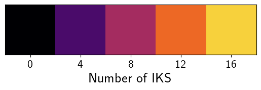
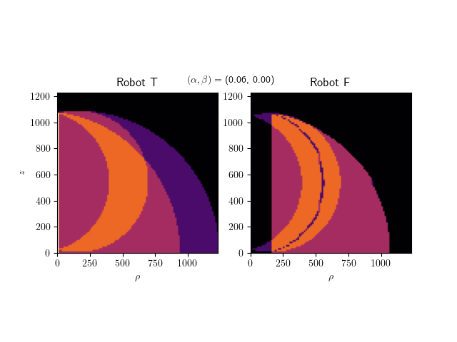
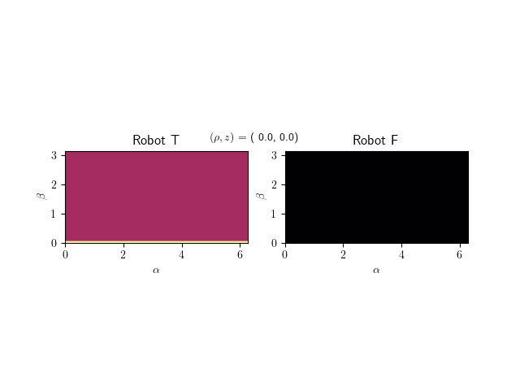

# Uniqueness Domains of  Offset Wrist Robots via a 4D  Workspace Representation

This is supplementary material to the paper Uniqueness Domains of  *Offset Wrist Robots via a 4D  Workspace Representation*.

To use the interactive workspace visualization, make run `python plotnSols.py`. You will be able to choose the robot structure and between two visualizations, one including a plot of the robot configurations (which might be slower as it computes the inverse kinematics live). It requires numpy, matplotlib and scipy. Make sure that `Robot.py` and the `data` folder are in the working directory.

The number of solutions is color coded as follows: 

The robots DH-Parameters are as in the paper, given by:
| $i$ | $d_i$ | $a_i$ | $\alpha_i$     |
|-----|-------|-------|----------------|
| 1   | 0     | 0     | $\frac \pi 2$  |
| 2   | 0     | 540   | 0              |
| 3   | 0     | 0     | $-\frac \pi 2$ |
| 4   | 540   | 0     | $\frac \pi 2$  |
| 5   | $d_5$ | $a_5$ | $-\frac \pi 2$ |
| 6   | 0     | 0     | 0              |

Additionally,  $d_5 = 0, a_5 = 150$ for *Robot T* and $d_5 = 150, a_5 = 0$ for *Robot F*.

## Animations

We provide animated versions of the workspace visualization for varying values of $(\alpha, \beta)$ or $(\rho, z)$, respectively.

